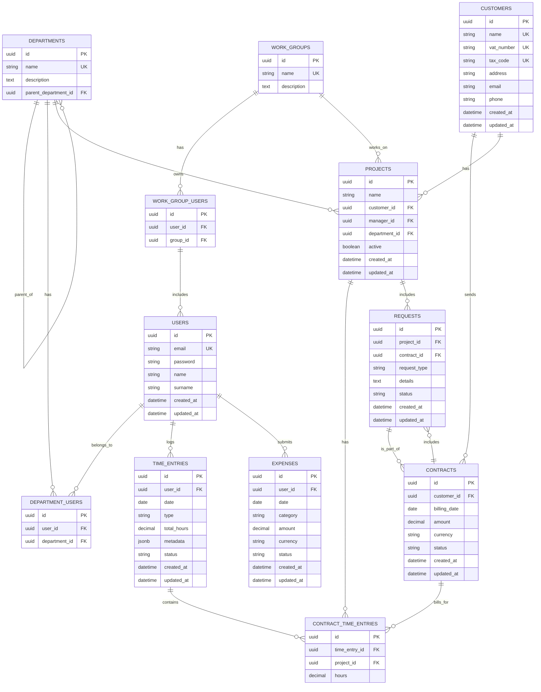

## Database Schema Overview

### Missing points
- Hourly rates per user/role so that time entries can be billed correctly
- Invoicing module

```mermaid
erDiagram
    USERS ||--o{ DEPARTMENT_USERS : "belongs_to"
    USERS ||--o{ TIME_ENTRIES : "logs"
    USERS ||--o{ EXPENSES : "submits"

    DEPARTMENTS ||--o{ DEPARTMENTS : "parent_of"
    DEPARTMENTS ||--o{ DEPARTMENT_USERS : "has"
    DEPARTMENTS ||--o{ PROJECTS : "owns"
    
    WORK_GROUPS ||--o{ WORK_GROUP_USERS : "has"
    WORK_GROUP_USERS ||--o{ USERS : "includes"
    WORK_GROUPS ||--o{ PROJECTS : "works_on"
    
    PROJECTS ||--o{ CONTRACT_TIME_ENTRIES : "has"
    PROJECTS ||--o{ REQUESTS : "includes"
    
    

    CONTRACTS ||--o{ CONTRACT_TIME_ENTRIES : "bills_for"
    CONTRACTS ||--o{ REQUESTS : "includes"
    REQUESTS ||--o{ CONTRACTS : "is_part_of"
    
    CUSTOMERS ||--o{ CONTRACTS : "sends"
    CUSTOMERS ||--o{ PROJECTS : "has"
    
    TIME_ENTRIES ||--o{ CONTRACT_TIME_ENTRIES : "contains"

    USERS {
        uuid id PK
        string email UK
        string password
        string name
        string surname
        datetime created_at
        datetime updated_at
    }

    DEPARTMENTS {
        uuid id PK
        string name UK
        text description
        uuid parent_department_id FK
    }
    
    WORK_GROUPS {
        uuid id PK
        string name UK
        text description
    }
    
    WORK_GROUP_USERS {
        uuid id PK
        uuid user_id FK
        uuid group_id FK
    }

    DEPARTMENT_USERS {
        uuid id PK
        uuid user_id FK
        uuid department_id FK
    }

    PROJECTS {
        uuid id PK
        string name
        uuid customer_id FK
        uuid manager_id FK
        uuid department_id FK
        boolean active
        datetime created_at
        datetime updated_at
    }

    TIME_ENTRIES {
        uuid id PK
        uuid user_id FK
        date date
        string type
        decimal total_hours
        jsonb metadata
        string status
        datetime created_at
        datetime updated_at
    }

    CONTRACT_TIME_ENTRIES {
        uuid id PK
        uuid time_entry_id FK
        uuid project_id FK
        decimal hours
    }

    EXPENSES {
        uuid id PK
        uuid user_id FK
        date date
        string category
        decimal amount
        string currency
        string status
        datetime created_at
        datetime updated_at
    }
    
    CUSTOMERS {
        uuid id PK
        string name UK
        string vat_number UK
        string tax_code UK
        string address
        string email
        string phone
        datetime created_at
        datetime updated_at
    }
    
    REQUESTS {
        uuid id PK
        uuid project_id FK
        uuid contract_id FK
        string request_type
        text details
        string status
        datetime created_at
        datetime updated_at
    }
    
    CONTRACTS {
        uuid id PK
        uuid customer_id FK
        date billing_date
        decimal amount
        string currency
        string status
        datetime created_at
        datetime updated_at
    }
```

