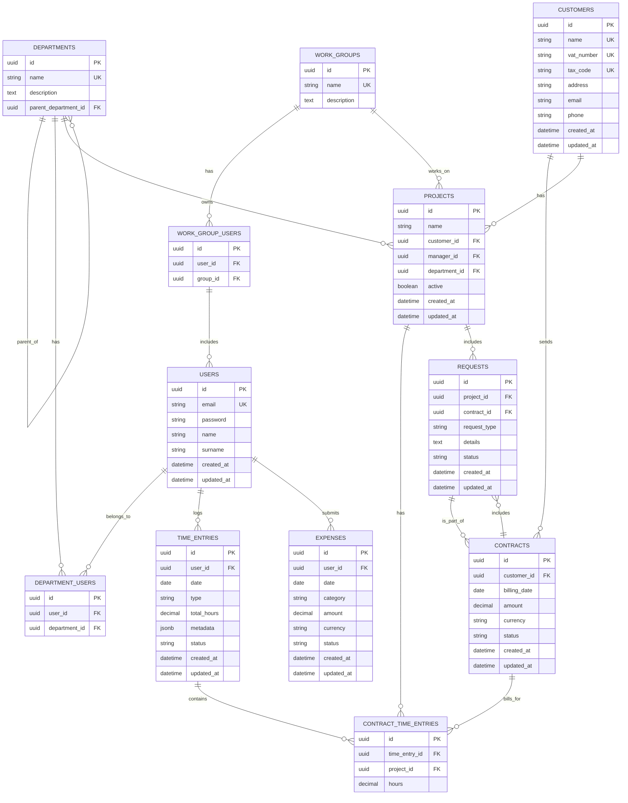

## Database Schema Overview

---

## System Functionality Overview

### 1. User Management
**Repository**: `UserRepository`

Core Operations:
- **Create User** (`create`) - Register new users with email, name, and password
- **Update User** (`update`) - Modify user details (firstname, lastname, password)
- **Find User by ID** (`findById`) - Retrieve specific user
- **Find User by Email** (`findByEmail`) - Lookup for authentication
- **List All Users** (`findAll`) - Get complete user directory
- **Delete User** (`deleteById`) - Remove user from system

**Use Cases**:
- User registration and onboarding
- Profile management
- Authentication (email-based login)
- User directory and search

---

### 2. Department Management
**Repository**: `DepartmentRepository`

Core Operations:
- **Create Department** (`create`) - Create new departments with hierarchical structure
- **Update Department** (`update`) - Modify department details
- **Find Department** (`findById`) - Retrieve specific department with users
- **Filter Departments** (`findAll`) - Search by name, description, or parent department
- **Delete Department** (`deleteById`) - Remove department

**Features**:
- Hierarchical structure (departments can have parent departments)
- Department-user associations
- Filtering capabilities for organizational structure queries

**Use Cases**:
- Organizational structure management
- Department hierarchy visualization
- User-to-department assignment
- Department-based reporting and analytics

---

### 3. Work Group Management
**Repository**: `WorkGroupRepository`

Core Operations:
- **Create Work Group** (`create`) - Form cross-functional teams
- **Update Work Group** (`update`) - Modify group details
- **Find Work Group** (`findById`) - Retrieve group with members
- **Filter Work Groups** (`findAll`) - Search by name, description, or members
- **Delete Work Group** (`deleteById`) - Disband work group

**Features**:
- Cross-departmental team formation
- User membership management
- Flexible filtering and search

**Use Cases**:
- Project team formation
- Cross-functional collaboration
- Resource allocation across departments
- Team-based work assignment

---

### 4. Customer Management
**Repository**: `CustomerRepository`

Core Operations:
- **Create Customer** (`create`) - Register new customers with full business details
- **Update Customer** (`update`) - Modify customer information
- **Find Customer** (`findById`) - Retrieve specific customer
- **Filter Customers** (`findAll`) - Search by company name, contact name, or email
- **Delete Customer** (`deleteById`) - Remove customer

**Features**:
- Complete business information (VAT, tax code, company name)
- Contact details (email, phone, address)
- Unique constraints on VAT number and tax code

**Use Cases**:
- Customer relationship management (CRM)
- Contract and project customer association
- Billing and invoicing preparation
- Customer directory and search

---

### 5. Project Management
**Repository**: `ProjectRepository`

Core Operations:
- **Create Project** (`create`) - Initialize new projects with all associations
- **Update Project** (`update`) - Modify project details and assignments
- **Find Project** (`findById`) - Retrieve specific project
- **Filter Projects** (`findAll`) - Multi-criteria search (customer, manager, department, work group, status)
- **Delete Project** (`deleteById`) - Archive/remove project

**Features**:
- Customer association
- Project manager assignment
- Department and work group assignment
- Active/inactive status tracking
- Timestamp tracking (created/updated)

**Use Cases**:
- Project initialization and setup
- Resource allocation (manager, department, team)
- Project portfolio management
- Active project tracking
- Customer project visibility

---

### 6. Time Entry Management
**Repository**: `TimeEntryRepository`

Core Operations:
- **Create Time Entry** (`create`) - Log time for various activity types
- **Update Time Entry** (`update`) - Modify existing entries
- **Find Time Entry** (`findById`) - Retrieve specific entry
- **Filter Time Entries** (`findAll`) - Search by user, date range, type, or status
- **Delete Time Entry** (`deleteById`) - Remove entry

**Entry Types & Metadata**:
- **Work** - Project work with location and description
- **Holiday** - Vacation time
- **Learning** - Training and education (student status tracking)
- **Demo** - Customer demonstrations
- **Permit** - Leave/absence with type specification

**Features**:
- Flexible metadata system (type-specific information)
- Status tracking (pending, approved, etc.)
- Total hours calculation
- Date-based filtering

**Related Entity**: `TimeEntryItem`
- Links time entries to specific projects with allocated hours
- Enables splitting time across multiple projects in a single day
- Essential for contract billing and project costing

**Use Cases**:
- Daily time logging
- Project time tracking
- Timesheet approval workflow
- Work-life balance monitoring
- Billable hours calculation
- Training time tracking
- Customer demo time allocation

---

### 7. Contract Management
**Repository**: `ContractRepository`

Core Operations:
- **Create Contract** (`create`) - Generate new contracts for customers
- **Update Contract** (`update`) - Modify contract details
- **Find Contract** (`findById`) - Retrieve specific contract
- **Filter Contracts** (`findAll`) - Search by customer, billing date range, or status
- **Delete Contract** (`deleteById`) - Remove contract

**Features**:
- Customer association
- Billing date tracking
- Multi-currency support
- Contract status management
- Amount tracking (note: currently using Long, needs BigDecimal)

**Use Cases**:
- Contract lifecycle management
- Billing schedule tracking
- Revenue forecasting
- Customer contract portfolio
- Financial reporting

---

### 8. Request Management
**Repository**: `RequestRepository`

Core Operations:
- **Create Request** (`create`) - Submit project/contract change requests
- **Update Request** (`update`) - Modify request details or status
- **Find Request** (`findById`) - Retrieve specific request
- **Filter Requests** (`findAll`) - Search by project, contract, type, or status
- **Delete Request** (`deleteById`) - Remove request

**Features**:
- Dual association (project AND contract)
- Request type categorization (Change, Extension, etc.)
- Detailed description field
- Status workflow tracking

**Use Cases**:
- Project scope change requests
- Contract extension requests
- Change order management
- Request approval workflow
- Project-contract modification tracking

---

### 9. Expense Management
**Repository**: `ExpenseRepository` ✅

Core Operations:
- **Create Expense** (`create`) - Submit expense with category and amount
- **Update Expense** (`update`) - Modify expense details
- **Find Expense** (`findById`) - Retrieve specific expense
- **Filter Expenses** (`findAll`) - Search by user, date range, category, or status
- **Delete Expense** (`deleteById`) - Remove expense

**Features**:
- User-submitted expenses
- Category-based classification
- Approval workflow (pending, approved, rejected)
- Multi-currency support
- Date and timestamp tracking

**Use Cases**:
- Expense report submission
- Expense approval workflow
- Reimbursement processing
- Expense analytics by category/user
- Budget tracking

---

### 10. Time Entry Items Management
**Repository**: `TimeEntryItemRepository` ✅

Core Operations:
- **Create Time Entry Item** (`create`) - Link time entry to project with hours
- **Update Time Entry Item** (`update`) - Modify project allocation or hours
- **Find Time Entry Item** (`findById`) - Retrieve specific item
- **Filter Time Entry Items** (`findAll`) - Search by time entry, project, or approval status
- **Delete Time Entry Item** (`deleteById`) - Remove item
- **Delete by Time Entry** (`deleteByTimeEntryId`) - Remove all items for a time entry

**Features**:
- Project-specific hour allocation
- Approval tracking per item
- Essential for contract billing
- Enables multi-project time splitting

**Use Cases**:
- Allocating daily hours across multiple projects
- Project-specific time tracking
- Billable hours calculation
- Time entry approval workflow

---

### 11. Department-User Association Management
**Repository**: `UserDepartmentRepository` ✅

Core Operations:
- **Add User to Department** (`create`) - Associate user with department
- **Find Associations** (`findAll`) - Filter by user or department
- **Remove Association** (`deleteById`) - Remove by association ID
- **Remove User from Department** (`deleteByUserAndDepartment`) - Remove specific association

**Features**:
- Many-to-many relationship management
- Unique constraint on user-department pairs
- Efficient filtering by user or department

**Use Cases**:
- Assigning users to departments
- Managing organizational structure
- Querying department membership
- User transfer between departments

---

### 12. Work Group-User Association Management
**Repository**: `WorkGroupUserRepository` ✅

Core Operations:
- **Add User to Work Group** (`create`) - Associate user with work group
- **Find Associations** (`findAll`) - Filter by user or work group
- **Remove Association** (`deleteById`) - Remove by association ID
- **Remove User from Work Group** (`deleteByUserAndWorkGroup`) - Remove specific association

**Features**:
- Many-to-many relationship management
- Cross-departmental team formation
- Cascade delete support
- Efficient filtering capabilities

**Use Cases**:
- Building project teams
- Managing cross-functional groups
- Querying team membership
- Resource allocation across teams

---

### 13. Authentication & Security
**Service**: `Authentication`

Core Operations:
- **Login** - JWT token generation
- **Logout** - Session termination
- **Token Validation** - JWT-based authentication

**Features**:
- JWT-based authentication
- Token expiration management
- User claims in token payload

**Use Cases**:
- Secure API access
- User session management
- Role-based access control (future)

---

## Key System Workflows

### Time-to-Bill Workflow
1. **Time Entry Creation** → User logs time with project association
2. **Time Entry Items** → Hours allocated to specific projects
3. **Contract Time Entries** → Project hours linked to contracts
4. **Contract Billing** → Contracts ready for invoicing

### Project Setup Workflow
1. **Customer Creation** → Register client
2. **Department & Work Group** → Assign organizational units
3. **Project Creation** → Link customer, manager, department, work group
4. **Contract Creation** → Associate billing terms with customer
5. **Time Tracking** → Start logging project hours

### Approval Workflow Pattern
Multiple entities use status-based workflows:
- **Time Entries**: pending → approved/rejected
- **Expenses**: pending → approved/rejected
- **Requests**: submitted → approved/rejected
- **Contracts**: draft → active → completed/cancelled

---

## Technical Requirements for Complete System

### ✅ Implemented
- User CRUD operations
- Department hierarchical management
- Work group management
- Customer management
- Project management with multi-entity associations
- Time entry with flexible metadata system
- **Time entry items management** (NEW)
- Contract management
- Request management
- **Expense management with approval workflow** (NEW)
- **Department-user association management** (NEW)
- **Work group-user association management** (NEW)
- JWT authentication

### 📋 To Be Developed
1. **Hourly Rate Management**
   - User/role-based hourly rates
   - Project-specific rate overrides
   - Rate history tracking
   - Billable vs non-billable rate differentiation

2. **Invoicing Module**
   - Invoice generation from contracts
   - Line item creation from time entries
   - Tax calculation
   - Multi-currency invoice support
   - Invoice status tracking (draft, sent, paid, overdue)
   - Payment tracking

3. **Reporting & Analytics**
   - Project profitability reports
   - User utilization reports
   - Department performance metrics
   - Customer billing summaries
   - Time allocation analysis

4. **Approval Workflows**
   - Multi-level approval chains
   - Notification system
   - Approval delegation
   - Audit trail

5. **Role-Based Access Control (RBAC)**
   - User roles and permissions
   - Department/project-based access
   - Manager hierarchies

6. **Budget Management**
   - Project budget allocation
   - Budget vs actual tracking
   - Expense budget limits
   - Alerts and notifications

7. **Resource Planning**
   - Capacity planning
   - Resource allocation across projects
   - Availability management
   - Conflict detection

---

## Data Consistency Requirements

### Critical Relationships to Maintain
- Users → Departments (many-to-many via department_users)
- Users → Work Groups (many-to-many via work_group_users)
- Projects → Customers, Managers, Departments, Work Groups
- Time Entries → Users, Projects (via time_entry_items)
- Contracts → Customers
- Requests → Projects AND Contracts
- Expenses → Users

### Cascade Delete Considerations
- Deleting a user should handle: time entries, expenses, project management
- Deleting a project should handle: time entries, requests
- Deleting a contract should handle: requests, contract time entries
- Deleting a department should handle: sub-departments, user associations

### Data Validation Rules
- Email uniqueness for users
- VAT number and tax code uniqueness for customers
- Department name uniqueness
- Work group name uniqueness
- Time entry dates cannot be future dates
- Total hours in time entry must match sum of time entry items
- Project must have valid references to customer, manager, department, work group
